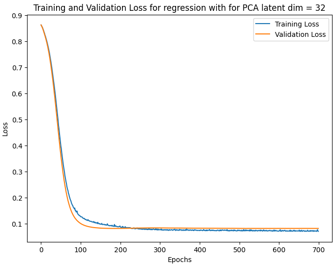

# VAE-PCA Signal Processing

### Dependencies ###
```
  torch
  torchvision
  torchaudio
  scikit-learn
  numpy
  pandas
  matplotlib
  tqdm
```

### Ideation ###
Dimensionality Reduction Techniques used : PCA and VAE
Step 1: Take the spectral features and reduce dimensions using PCA or VAE
  Extra Step : For VAE, pre-train on the training set to reconstruction loss and KL divergence loss on Standard Normal Distirbution for latent space
Step 2: After Projection, use a small neural network to train on the regression targets.

### Information about codebase ###
Models :
```
  ./Model
      |___model.py
          |_________ VAE, PCA, RegressionNN

  > from Models.model import VAE, PCA, RegressionNN
  > vae_model = VAE(input_dim, hidden_dim, latent_dim)
    |______ input_dim : represents the input data size, hidden_dim : hidden unit size,
            latent_dim : size of latent dimension

  > pca_model = PCA(n_components = 32)
    |______ n_components : represents size of latent dimension

  > reg_model = RegressionNN(input_dim, output_dim)
```

Data : 
```
  ./Data
      |____TASK-ML-INTERN.csv

  ./utils
      |____data.py
              |_______ SignalData

  ### Define and load the VAE model ###
  device = "cuda" if torch.cuda.is_available() else "cpu"
  model = VAE(input_dim=448, hidden_dim=128, latent_dim=32) ### Define the model
  model = model.to(device) 
  
  model.load_state_dict(torch.load("Checkpoints/best_VAE_32d.pt", weights_only=True)) ### Load the checkpoint
  model.eval()
  
  ### Load data and project data using VAE ###
  device = "cuda" if torch.cuda.is_available() else "cpu"
  signal_data = SignalData(csv_file="Data/TASK-ML-INTERN.csv", device = device)
  signal_data.x = signal_data.project_data(mode = "vae", model=model) ### Data Projection
  signal_data.split_data() #### Split the data into train, test and val data
  trainloader, valloader, testloader = signal_data.create_dataloader(batch_size=32) ### Create Dataloader
```

Trainers :
```
  ./utils
      |_____trainer.py
                |________ VAETrainer, RegressionTrainer

  > trainer = RegressionTrainer(model=reg_model,
                                loss_fn=loss_fn, optimizer=optimizer,
                                epochs = epochs, model_name = "best_regressor_pca32d",
                                device = device)
  > trainer.train(trainloader, valloader)

  > trainer = RegressionTrainer(model=reg_model, loss_fn=loss_fn,
                                optimizer=optimizer, epochs = epochs,
                                model_name = "best_regressor_vae32d",
                                device = device)
  > trainer.train(trainloader, valloader)
```


### Target Scaling ###
The targets were scaled using a MinMax Scaler so the output layer of the Neural Network has Sigmoid activation which trained the model quite easily. Then we optmize the Binary Cross Entropy Loss function on the output. From our tests, we found that mean squared loss is not a suitable loss function for the labels. We were unable to train it on MSE Loss. 

### Results ###
`Targets scaled to [0,1] using MinMax Scaler`

`Train Split = 0.8`

`Val Split = 0.1`

`Test Split = 0.1`'

`VAE and PCA Latent dimension = 32`

`Regression NN Model =  32 (input features) --(Relu)--> 128 --(Relu)--> 64 --(Relu)--> 8 --(Relu)--> 1 ---> Sigmoid `

| Model                                   | Test Loss  | 
|-----------------------------------------|------------|
| Regression NN + PCA Latent 32 dimension | 0.18186    |
| Regression NN + VAE Latent 32 dimension | 0.24823    |

### Training and validation ###
<p align="center"></p>
The above image represents the unsupervised training of VAE with the training data.

### Regression Training Statistics ###
<p align="center"></p>
<p align="center"></p>


